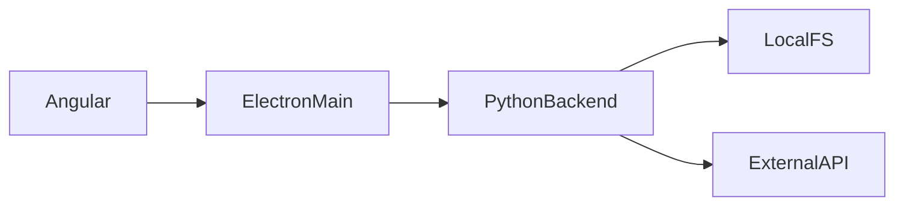
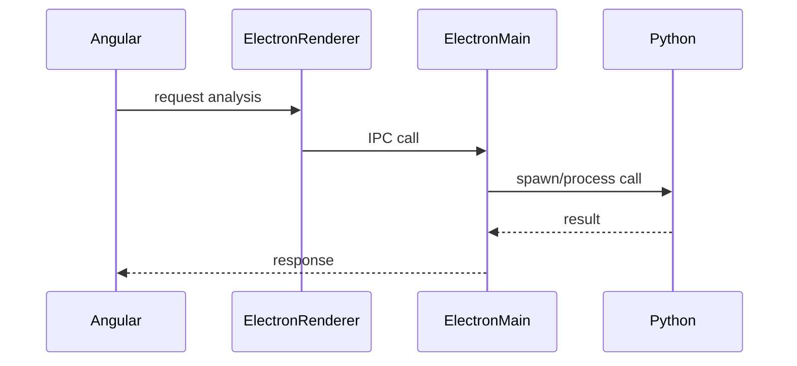
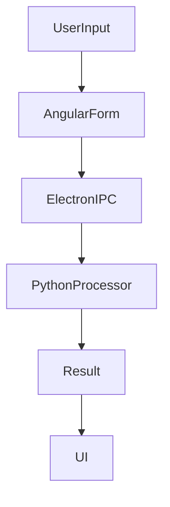

# ReviewPackets Deep Technical Analysis

## 1. Executive Summary

### Problem the project solves
ReviewPackets solves a very specific operational pain: teams receive large issue dumps (Excel/CSV), then manually check selected fields for missing data and generate review comments. That manual flow is repetitive, inconsistent, and slow when issue volume is high.

The core value of ReviewPackets is that it converts a manual spreadsheet-review task into a deterministic local workflow:
1. Upload main issue dump.
2. Upload or paste issue keys to scope review.
3. Select review columns.
4. Generate preview with auto-comments.
5. Export result as CSV.

This removes repeated manual effort and reduces reviewer-to-reviewer variation.

### Who uses it
Primary users are internal QA, release, and review coordination teams working on Windows desktops. Secondary users are leads who need clean review-ready exports.

### Why this architecture was chosen
The architecture is intentionally hybrid:
- **Electron** for desktop packaging and process orchestration.
- **Angular** for an interactive, form-heavy UI.
- **Python/FastAPI/pandas** for spreadsheet-heavy business logic.

This architecture was chosen because spreadsheet processing is easier and safer in Python/pandas, while UI productivity and installer distribution are better served by web + Electron.

### Key technologies used
- **Electron 30** for desktop runtime (`electron/main.js`).
- **Angular 18 + Material** for UI (`frontend/src/app`).
- **FastAPI + Uvicorn** for local API server (`backend/main.py`).
- **pandas + openpyxl** for Excel/CSV read/transform (`backend/utils/file_loader.py`).
- **PyInstaller** for backend exe (`backend/reviewpackets.spec`).
- **electron-builder (NSIS)** for Windows installer (`electron-builder.json`).

### System boundaries
Inside system:
- Desktop shell
- UI interactions
- local HTTP API
- file parsing, filtering, preview generation, CSV export
- local logs and temporary uploads

Outside system:
- cloud persistence
- multi-user collaboration
- authentication/authorization domain
- remote APIs (currently not used)

This is currently a single-user local desktop workflow engine, not a distributed platform.

## 2. High-Level Architecture

### Detailed architecture explanation
The runtime has three major boundaries:
1. **Electron main process** controls application lifecycle and starts backend process.
2. **Angular renderer** handles user interactions and calls backend API over localhost.
3. **Python backend process** performs all file processing and review logic.

Data never needs to leave the user machine for normal operation.

### Process boundaries
- Electron main process: Node.js process created by Electron.
- Angular renderer process: Chromium renderer sandboxed with `contextIsolation: true` and `nodeIntegration: false`.
- Python backend process: spawned child process (`ReviewPacketsBackend.exe` or `python -m uvicorn ...`).

### Threading/process model
- Electron main: event-loop based single process.
- Renderer: browser event loop and Angular change detection.
- Python backend: single Uvicorn server process (default worker model here is effectively one process), request handling in FastAPI endpoints.
- Shared app state is in `DATA_STORE` guarded by a `threading.Lock` (`backend/repositories/data_store.py`) to avoid data races when requests overlap.

### System architecture diagram



### Component/arrow explanation
- `Angular --> ElectronMain`:
  In current implementation, there is no functional IPC request path for business operations. Angular runs inside Electron renderer and receives desktop runtime context indirectly. The only explicit bridge today is `window.reviewpackets.version` via preload. So this arrow represents the renderer being hosted and managed by Electron, not active IPC workflow for analysis execution.

- `ElectronMain --> PythonBackend`:
  This is a real runtime dependency. In `electron/main.js`, Electron resolves backend command and spawns the Python backend process. Lifecycle coupling is direct: app launch starts backend; window close kills backend process.

- `PythonBackend --> LocalFS`:
  Real and central. Uploaded files are persisted to `backend/uploads`, logs to `backend/logs/reviewpackets.log`, and data is read via pandas/openpyxl.

- `PythonBackend --> ExternalAPI`:
  Currently **not active** in codebase. This arrow is architectural headroom: backend could call external systems in future (ticket systems, metadata services), but present implementation is fully offline/local.

## 3. Component-Level Architecture

### 3.1 Angular Frontend

#### Folder structure
- `frontend/src/main.ts`: bootstraps standalone app.
- `frontend/src/app/app.component.ts`: main interaction controller.
- `frontend/src/app/app.component.html`: UI workflow steps and table rendering.
- `frontend/src/app/services/api.service.ts`: HTTP API client.
- `frontend/src/app/models/api.models.ts`: DTO interfaces.
- `frontend/src/styles.scss`: Material theme + layout styles.

#### Key modules and state handling
This app uses a single standalone component without NgRx/global store. State is component-local fields:
- `headers`, `defaultFilters`, `selectedFilters`
- `previewRows`, `displayedColumns`
- `isLoading`, file names

This is simple and fast for current size but has scaling limits as features grow.

#### API communication
`ApiService` uses `HttpClient` and fixed base URL `http://127.0.0.1:8000/api`.
Endpoints consumed:
- `GET /default-filters`
- `POST /dump`
- `POST /keys/file`
- `POST /keys/text`
- `POST /preview`
- `POST /export`

### 3.2 Electron Layer

#### Main process
`electron/main.js` responsibilities:
- Resolve backend run command (packaged exe, unpacked exe, or Python module).
- Spawn backend child process.
- Create BrowserWindow with security flags:
  - `contextIsolation: true`
  - `nodeIntegration: false`
- Load Angular app from local file (packaged) or dev server.
- Kill backend on window close.

#### Renderer process
Renderer is Angular app served either by Angular dev server (`localhost:4200`) or packaged static files.

#### Preload scripts
`electron/preload.js` exposes limited API:
- `window.reviewpackets.version`

#### IPC communication
Current system does **not** use `ipcMain`/`ipcRenderer` for business operations. Data plane is HTTP directly from Angular to backend.

#### Security model
Positive:
- `contextIsolation` enabled.
- `nodeIntegration` disabled.
- Minimal preload surface.

Gaps:
- no CSP hardening captured in code.
- no strict runtime allowlist for navigation/permissions.

### 3.3 Python Backend

#### Entry point
- `backend/main.py`: creates FastAPI app, CORS middleware, router registration.
- `run()` executes Uvicorn with custom log config.

#### API layer
`backend/api/routes.py` defines endpoints for config retrieval, uploads, preview, export.

#### Services
- `DumpService`: validate/load dump and expose headers.
- `KeysService`: load keys from file or comma-separated text.
- `PreviewService`: perform filter logic and comment generation.

#### Repository
- `DATA_STORE` in-memory singleton with lock.

#### Utilities
- `file_loader.py`: type-based file parsing and normalization.
- `merge.py`: duplicate-header collapse logic.
- logging utilities for rotating file log.

#### External integrations
No remote integrations in current build.

### Sequence diagram (requested)



### What happens in this project relative to this diagram
- Step 1 exists conceptually (user action in Angular renderer).
- Steps 2/5 do not happen for analysis logic today (no IPC channels for operations).
- Step 3 happens only for app startup process management.
- Operational request/response path is currently:
  `Angular -> FastAPI (HTTP) -> Service -> response -> Angular`.

## 4. End-to-End Code Flow

### 4.1 App startup flow
1. Electron app lifecycle reaches `app.whenReady()` (`electron/main.js`).
2. `startBackend()` calls `resolveBackendCommand()`.
3. Resolution order:
   - packaged exe at `resources/backend/ReviewPacketsBackend.exe`
   - unpacked exe at `backend/dist/ReviewPacketsBackend.exe`
   - fallback python uvicorn command
4. Electron spawns backend child process and wires stdout/stderr logging.
5. Electron creates BrowserWindow and defers visibility until `ready-to-show`.
6. UI source chosen:
   - packaged: local `frontend/dist/reviewpackets/browser/index.html`
   - dev: `http://localhost:4200`
7. Backend FastAPI app bootstraps:
   - `setup_logging()`
   - CORS middleware
   - router mounted at `/api`
8. System reaches ready state when renderer is visible and backend is listening on `127.0.0.1:8000`.

### 4.2 User action flow (example: Generate Preview button)
1. User clicks **Generate Preview** in `app.component.html`.
2. `AppComponent.generatePreview()` validates that filters are selected.
3. UI sets `isLoading=true` and calls `api.preview({ filters })`.
4. `ApiService.preview()` sends `POST /api/preview`.
5. FastAPI route `preview()` receives payload (`PreviewRequest`).
6. Route calls `preview_service.build_preview(filters)`.
7. Service acquires lock, copies dump dataframe and key list from `DATA_STORE`.
8. Service validates required columns (`Issue Key`, optional fallback for `Summary`).
9. If keys exist, dataframe is filtered to matching issue keys.
10. For each selected filter column:
    - map to existing column (case-insensitive), or create empty column if absent.
11. For each row, build output row and comment list (`<field> is blank`).
12. Route converts dataframe to records and returns `PreviewResponse`.
13. Angular success handler sets `previewRows` and `displayedColumns`.
14. UI table rerenders with new data.
15. `finalize()` resets `isLoading=false`.

### 4.3 User action flow (example: Export CSV)
1. User clicks **Export CSV**.
2. Angular calls `ApiService.exportCsv`.
3. Backend route rebuilds preview dataframe from same filter logic.
4. Dataframe serialized to CSV in `StringIO`.
5. `StreamingResponse` returned with attachment header.
6. Angular receives Blob, creates object URL, triggers download via anchor.

## 5. Detailed Code Walkthrough

### `electron/main.js`
Purpose:
- Desktop lifecycle and backend process orchestration.

Key logic:
- `resolveBackendCommand()` chooses runtime mode.
- `startBackend()` spawns process, attaches logs.
- `createWindow()` applies renderer security flags and loads UI.

Why designed this way:
- Supports both development and packaged deployment with a single file.
- Keeps backend independent and replaceable (exe or python).

Error handling:
- process spawn error logged, but no auto-retry/backoff.

### `electron/preload.js`
Purpose:
- narrow bridge between main world and isolated renderer.

Key logic:
- exposes `version` only.

Why:
- minimize attack surface while still allowing app metadata in renderer.

### `backend/main.py`
Purpose:
- build and expose FastAPI app.

Key logic:
- logging setup
- CORS config
- router registration
- uvicorn run helper

Why:
- clean app factory pattern supports importable app for tests and packaged run.

### `backend/api/routes.py`
Purpose:
- transport layer for HTTP contracts.

Key logic:
- request parsing and response models
- calls services; maps `ValueError` to HTTP 400
- handles upload persistence and CSV stream response

Why:
- keeps route functions thin and business logic in services.

Error handling:
- catches domain validation errors; does not yet normalize unexpected exceptions to structured error model.

### `backend/services/dump_service.py`
Purpose:
- load dump and validate schema minimum.

Why logic exists:
- ensures downstream preview logic always has `Issue Key` anchor column.

### `backend/services/keys_service.py`
Purpose:
- unify keys input from file and text.

Design choice:
- both input modes end in a single canonical `issue_keys` list.

### `backend/services/preview_service.py`
Purpose:
- central business logic for review packet generation.

Important logic:
- case-insensitive column resolution.
- optional `Summary` handling.
- per-row blank-field comment generation.

Why written this way:
- tolerates messy real-world dumps while keeping output schema stable.

Potential performance concern:
- row-wise `iterrows()` loop may degrade for very large datasets.

### `backend/utils/file_loader.py`
Purpose:
- controlled file parsing by extension with normalization.

Important logic:
- enforce supported extensions.
- parse csv/excel with dtype=str and no default NaN.
- call duplicate header merge utility.

Why:
- avoid type drift and `NaN` surprises in downstream string comparisons.

### `backend/utils/merge.py`
Purpose:
- normalize duplicate column headers and merge values.

Important logic:
- normalizes headers like `Solution.1` to `Solution` when base exists.
- merges duplicate column cells with ` | ` delimiter.

Why:
- pandas often auto-suffixes duplicate header names; this preserves all data without silent loss.

### `frontend/src/app/app.component.ts`
Purpose:
- orchestrates UI user journey end-to-end.

Key functions:
- `loadDefaults`, `onDumpSelected`, `onKeysSelected`, `submitKeysText`, `generatePreview`, `exportCsv`.

Why written this way:
- single coordinator component keeps implementation fast for MVP stage.

Error handling:
- user feedback via snackbar messages on each API call.

### `frontend/src/app/services/api.service.ts`
Purpose:
- typed API client wrapper.

Why:
- isolates URL paths and HTTP details from component logic.

## 6. IPC Communication Design

### Current state
Operational IPC is minimal to none:
- No `ipcMain.handle(...)`
- No `ipcRenderer.invoke(...)`
- No custom business channel names
- Renderer talks to backend through HTTP directly

Only preload bridge exists:
- `window.reviewpackets.version`

### Request/response model in current system
- transport is REST over localhost, async non-blocking via Angular Observables.
- request errors come back as HTTP status with `{ detail }` when mapped from backend `ValueError`.

### Sync vs async
- frontend/backend interaction: async.
- file processing can still block backend worker due to CPU-bound pandas operations.

### Error propagation
- backend ValueError -> HTTP 400 -> Angular snackbar.
- unexpected backend process crash is not currently surfaced with explicit health/reconnect UX.

### Security risks in IPC area
- If future IPC channels are added without strict allowlist and payload validation, renderer-to-main attack surface can grow quickly.

### Recommended IPC diagram (future if moving operations through Electron)

```mermaid
flowchart LR
UI[Angular Renderer] -->|ipcRenderer.invoke(channel,payload)| Main[Electron Main]
Main -->|validate payload + allowlist| Worker[Python Backend]
Worker -->|result/error| Main
Main -->|resolved/rejected Promise| UI
```

## 7. Data Flow Analysis

### Input data sources
- User-selected dump file (`xlsx/xls/csv`).
- Keys file or pasted key string.
- Selected filter column list.

### Transformations
- File read to DataFrame with all values as strings.
- Duplicate headers merged.
- Keys normalized (`strip`).
- Dump filtered by selected keys.
- Selected columns checked for blank values.
- Comment field synthesized.

### Storage
- transient file copy in `backend/uploads`.
- in-memory canonical state in `DATA_STORE`.
- logs persisted in rotating log file.

### Output generation
- JSON preview rows for UI table.
- CSV stream for export.



Note: in current code, `ElectronIPC` is effectively replaced by direct HTTP call from Angular to Python backend over localhost.

## 8. Design Decisions and Tradeoffs

### Why Electron
Decision:
- desktop distribution on Windows with one installer.

Tradeoff:
- larger app footprint than native frameworks.

### Why Python backend
Decision:
- spreadsheet and data transforms are quicker and safer in pandas.

Tradeoff:
- extra process to manage; packaging complexity (PyInstaller, hidden imports).

### Why Angular
Decision:
- structured UI for multi-step workflow and future scaling.

Tradeoff:
- heavier than a minimal static frontend for this current scope.

### Alternatives considered
- Pure web app + hosted backend: simpler updates, but violates offline/local requirement.
- Pure Node backend: fewer runtimes, but weaker ergonomics for Excel-heavy transforms.
- Tauri + Rust backend: smaller binary, but higher team adoption cost.

### Performance implications
- Good for moderate datasets.
- Row-wise iteration and full in-memory dataframe copy can become bottlenecks for very large files.

### Scalability limits
- Single-user local process model.
- in-memory state only.
- no job queue or chunked processing.

## 9. Error Handling Strategy

### Frontend errors
- API failure shown via snackbar (`err?.error?.detail` fallback generic).
- loading spinner via `finalize` ensures UI recovers from both success/failure.

### Backend validation errors
- service `ValueError` converted to HTTP 400.

### IPC/process failures
- backend spawn error logged in Electron console.
- no proactive restart or health-check watchdog.

### Python crashes
- child process death is not currently observed with user-facing recovery flow.

### Retry logic
- none currently for API calls or backend process bootstrap.

### Logging
- rotating file logs configured for general app and Uvicorn logs.
- useful baseline for support troubleshooting.

## 10. Security Considerations

### Electron hardening currently present
- `contextIsolation: true`
- `nodeIntegration: false`
- narrow preload exposure

### Risks and controls needed
- Local HTTP server is bound to `127.0.0.1`; good local scoping.
- CORS allows localhost dev origins only; acceptable for local app.
- File uploads are written using original filename; needs sanitization/uniqueness to avoid overwrite and path concerns.
- No explicit file size enforcement at route ingress despite `MAX_UPLOAD_MB` constant.
- No antivirus/signing pipeline in config (code-sign disabled for local builds), which is okay for internal unsigned builds but not ideal for enterprise trust.

### Validation
- extension validation exists.
- required column validation exists.
- deeper content/schema validation can be expanded.

## 11. Performance Analysis

### Potential bottlenecks
- `file.file.read()` reads entire upload into memory in one shot.
- `pandas.read_excel` is CPU/memory heavy for large workbooks.
- preview generation uses Python-level row iteration (`iterrows`), slower than vectorized operations.

### Memory behavior
- full dataset held in `DATA_STORE.dump_df`.
- preview generation copies dataframe, doubling memory temporarily.

### Startup cost
- Electron starts quickly; backend spin-up and pandas import cost are dominant.
- packaged exe cold start may be slower due to Python runtime bootstrap.

### Optimization opportunities
- stream upload to disk in chunks.
- avoid full dataframe copy when safe.
- vectorize blank-check logic where possible.
- paginate preview for very large outputs.
- add simple health endpoint and warm-up checks.

## 12. Deployment Architecture

### Build pipeline
Root script (`package.json`) orchestrates:
1. `build:frontend` -> Angular production build.
2. `build:backend` -> venv setup + pip install + PyInstaller.
3. `build:electron` -> electron-builder NSIS packaging.

### Packaging details
- Electron bundle includes `electron/**/*` and `frontend/dist/**/*`.
- Backend exe copied as extra resource to `resources/backend/ReviewPacketsBackend.exe`.
- Windows target: NSIS installer.

### Runtime dependencies
Build-time:
- Node/npm
- Python 3.11/3.12
- pip wheels for pandas/openpyxl

Runtime (packaged):
- no separate Python install required when backend exe is present.

### Environment setup
Dev mode requires:
- backend uvicorn running on 8000
- frontend ng serve on 4200
- electron app loading renderer and spawning backend (fallback path)

## 13. Future Improvements

### Scalability and robustness
- add persistent session state (optional local DB or serialized snapshot).
- introduce background job model for long-running preview tasks.

### Architecture refactor
- split Angular `AppComponent` into workflow subcomponents.
- add backend service interfaces and dependency injection for testability.

### Security upgrades
- enforce upload size limit and stronger filename policy.
- add integrity checks and stricter content validation.

### Performance upgrades
- replace row loop with vectorized/pandas operations.
- add pagination and lazy rendering in table.

### Observability
- add structured request IDs and timing logs.
- expose health endpoint and backend process status to UI.

### IPC roadmap (optional)
- if backend access should be hidden from renderer, move API calls through Electron IPC proxy with strict channel allowlists.

## 14. Developer Onboarding Guide

### 14.1 Run locally
1. Backend:
   - `python -m venv backend/.venv`
   - `backend/.venv/Scripts/python -m pip install -r backend/requirements.txt`
   - `backend/.venv/Scripts/python -m uvicorn backend.main:app --host 127.0.0.1 --port 8000`
2. Frontend:
   - `cd frontend`
   - `npm install`
   - `npm start`
3. Electron shell (new terminal from repo root):
   - `npm install`
   - `npx electron .`

### 14.2 Debug flow
- Backend logs: `backend/logs/reviewpackets.log`
- Electron + backend stdout/stderr: terminal where electron runs
- Frontend: browser devtools inside Electron renderer

Suggested first debug checkpoints:
- verify backend start command resolution in `electron/main.js`.
- verify `POST /api/dump` and returned headers.
- verify `PreviewService.build_preview` output for selected filters.

### 14.3 Add a new feature (example: new computed review rule)
1. Add rule logic in `backend/services/preview_service.py`.
2. Extend response schema if needed in `backend/models/schemas.py`.
3. Add/update endpoint behavior in `backend/api/routes.py`.
4. Update Angular API model/interfaces.
5. Update UI to display new field.
6. Add unit tests in `backend/tests`.

### 14.4 Testing
Current tests:
- `backend/tests/test_merge.py`
- `backend/tests/test_preview.py`

Recommended command:
- `backend/.venv/Scripts/python -m pytest backend/tests`

Add next:
- API route tests with FastAPI TestClient.
- integration tests for upload -> preview -> export flow.

---

## Final Technical Assessment

ReviewPackets is a solid local-first architecture for spreadsheet-driven review automation. The project intentionally optimizes for internal desktop usability and rapid business logic delivery. The key strengths are clear layering, strong data tooling choice (pandas), and workable packaging strategy. The main technical debt areas are process resilience, validation hardening, and scaling the UI/backend implementation patterns for larger datasets and future feature growth.
