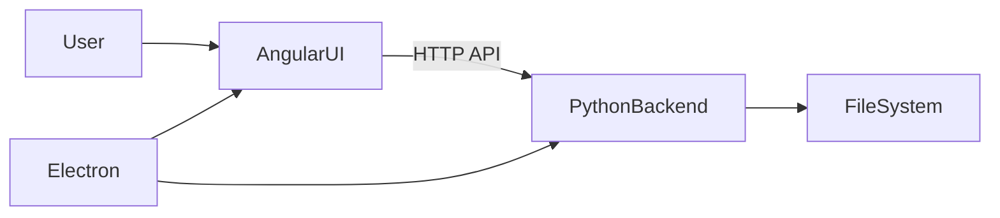
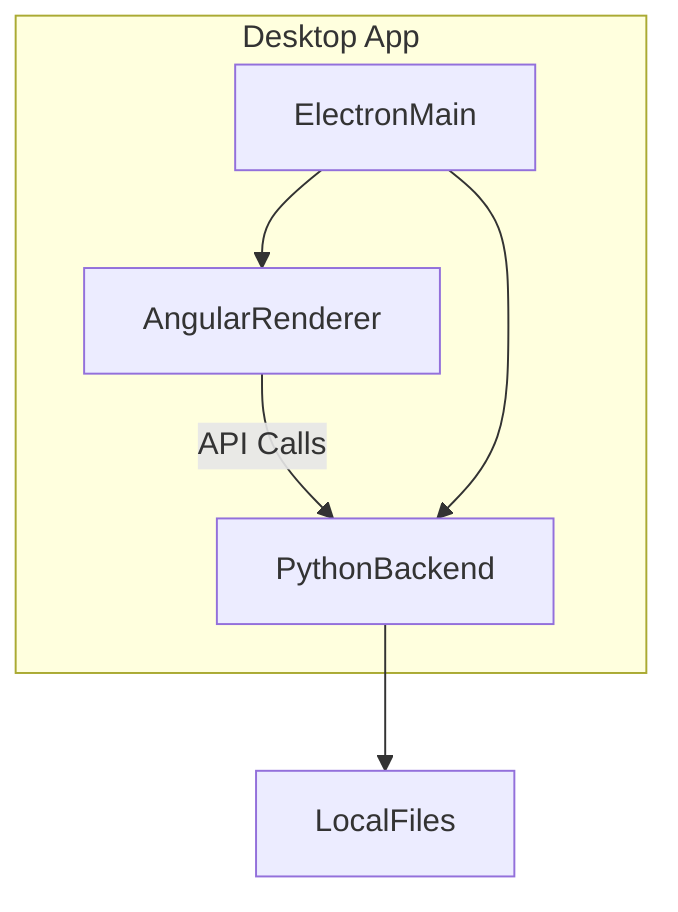
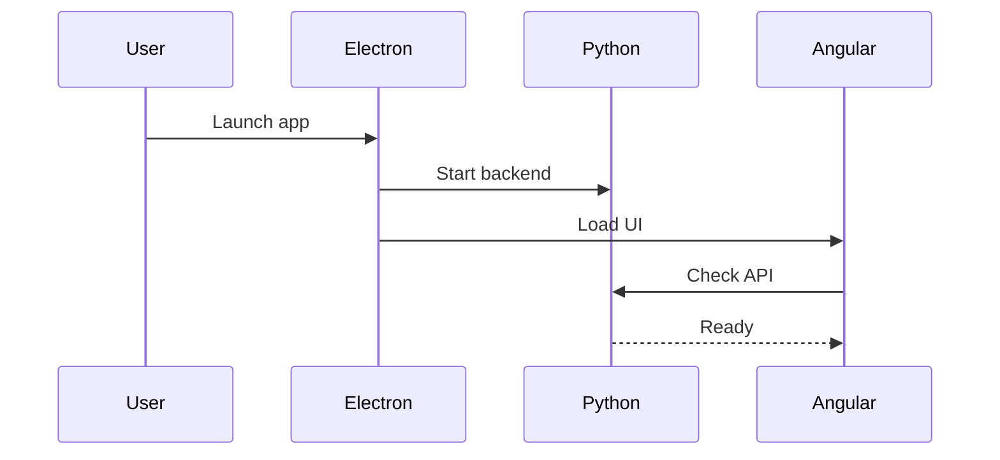
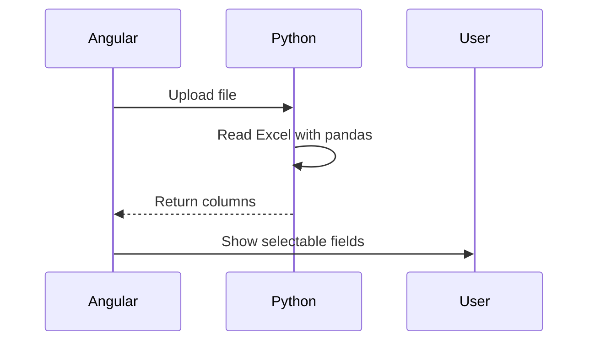
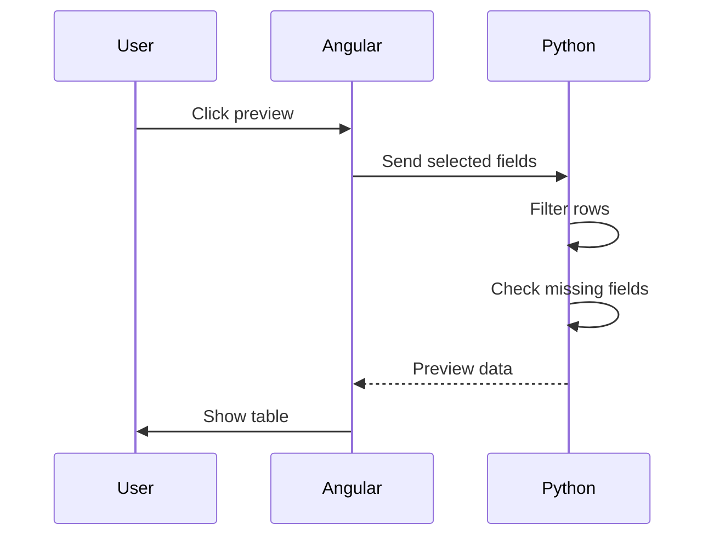
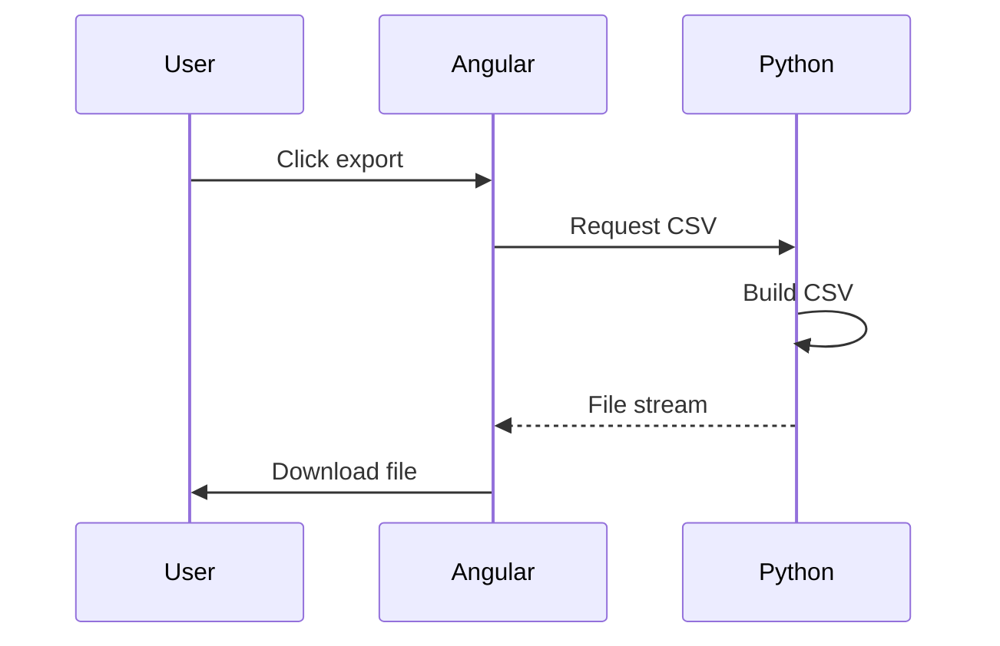
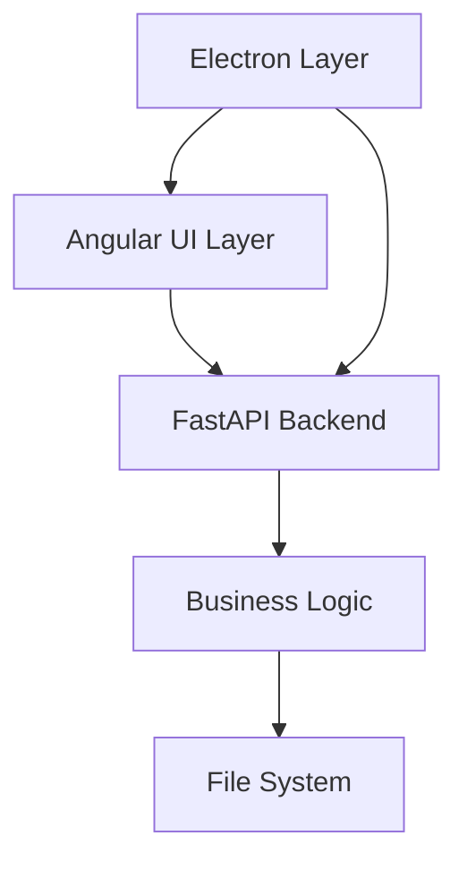
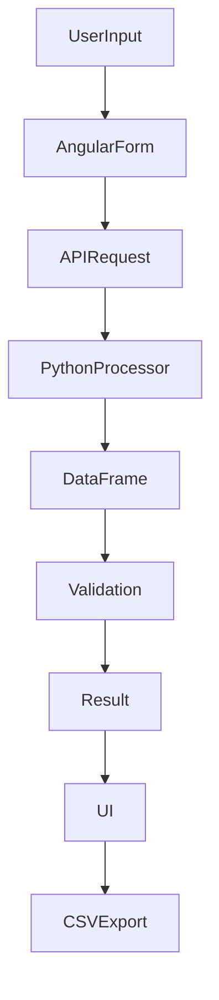

# ReviewPackets – Beginner Friendly Architecture & Technical Summary

## 🧠 What this project is
This project is a **desktop application** that helps teams automatically review large Excel/CSV files and generate review comments.  
Instead of manually checking spreadsheets, the app automates the workflow:

1. Upload issue dump  
2. Select fields to validate  
3. Generate preview  
4. Auto-create comments  
5. Export CSV  

It saves time and ensures consistent review results.

---

## 🧩 Tech Stack Overview

- **Angular** → User Interface  
- **Electron** → Desktop runtime  
- **Python (FastAPI + pandas)** → Data processing  

---

## 🏗 High Level Architecture

### Explanation
- Angular handles UI
- Python processes Excel files
- Electron runs both as desktop app
- Data stays local on machine

---

## 🖥 Component Architecture

---

## 🔄 App Startup Flow

---

## 📥 File Upload Flow

---

## 🔍 Preview Generation Flow

---

## 📤 Export Flow

---

## 🧱 Layered Architecture

---

## 🔐 Security Design

- Context isolation enabled  
- Node integration disabled  
- Localhost API only  

---

## 📊 Data Flow

---

## 🚀 Why this architecture?

| Need | Solution |
|------|---------|
Desktop app | Electron |
Rich UI | Angular |
Excel processing | Python pandas |
Offline use | Local backend |
Easy install | Electron builder |

---

## ⚠ Current Limitations
- Single user only  
- In-memory storage  
- Large files may slow  
- No auto-restart backend  

---

## 🔮 Future Improvements
- Pagination for large files  
- Better error recovery  
- Backend health checks  
- Modular UI components  
- Performance optimization  

---

## 🧑‍💻 How new developers should understand it

1. Angular → UI logic  
2. Electron → startup + packaging  
3. Python → main processing  

Most new features will go into **Python backend**.

---

## 🧾 One‑line summary
A desktop tool that reads Excel issue dumps, validates selected fields, generates review comments, and exports results using Angular, Electron, and Python.

